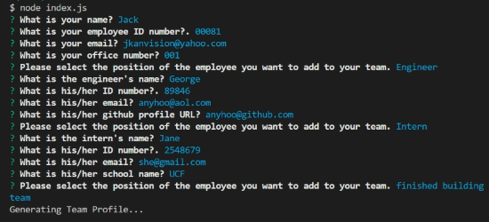

  
  # Team-Profile-Generator
   

  

  ## Description: 
  This command-line application offers a template for quickly designing an HTML page. It features an employee roster theme, allowing the user to create team member cards with individual properties for each.
  &nbsp;
  &nbsp;

  &nbsp;
  &nbsp;
  ## Table of Contents
  - [Installation](#installation)
  - [Usage](#usage)
  - [License](#license)
  - [Contributing](#contributing)
  - [Tests](#tests)
  - [Questions](#questions)
   

  &nbsp;
  &nbsp;
  ## Installation:
  To install necessary dependencies, run the following command:
  >            npm i
  

  &nbsp;
  &nbsp;
  ## Usage:
  To create your Team Profile HTML, open your command-line interface and run the following command:
  >                  node index.js
  

  Then, answer the questions and view the finished product!
  &nbsp;
  &nbsp;

&nbsp;
&nbsp;
Video Walkthrough:

  

  &nbsp;
  &nbsp;
  ## License:
      This project is licensed under the MIT license.

    
  &nbsp;
  &nbsp;

  ## Contributing:
  create a fork, push your code, and make a pull request
  &nbsp;
  &nbsp;

  &nbsp;
  &nbsp;
  ## Tests:
  To run tests, run the following command:
  >           npm test
  &nbsp;
  &nbsp;
  
  &nbsp;
  &nbsp;
  ## Questions:
  If you have questions about this project, please contact me at [jkanvision@knights.ucf.edu](mailto:jkanvision@knights.ucf.edu). You can view my other projects by visiting my GitHub profile: [https://github.com/jkanvision](https://github.com/jkanvision).